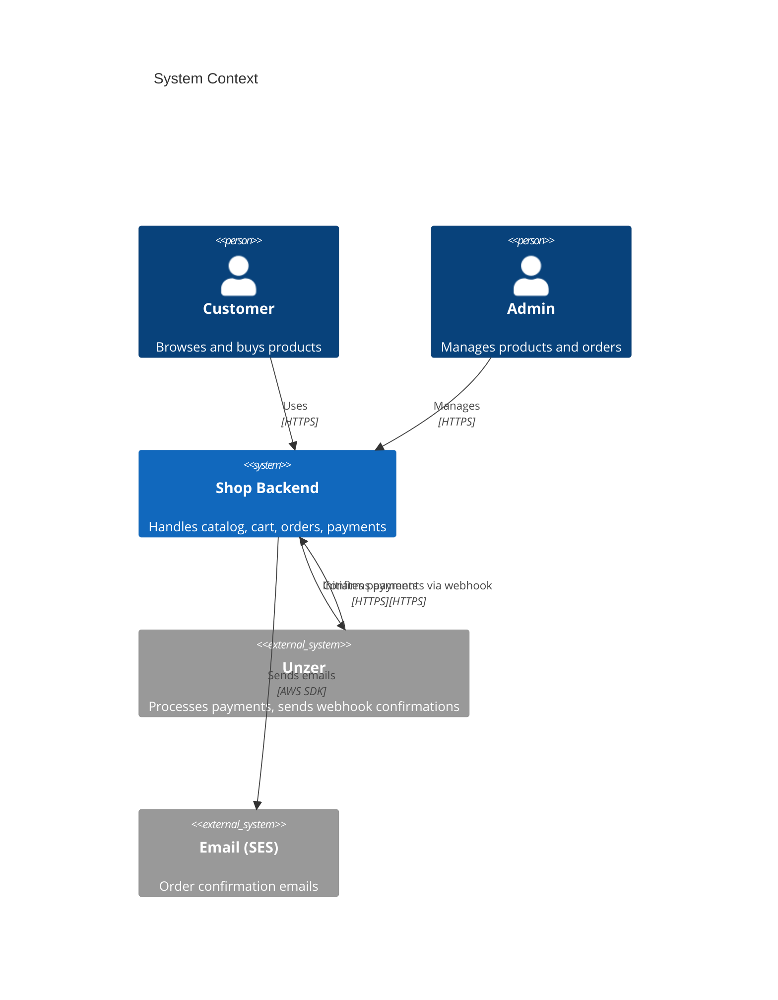
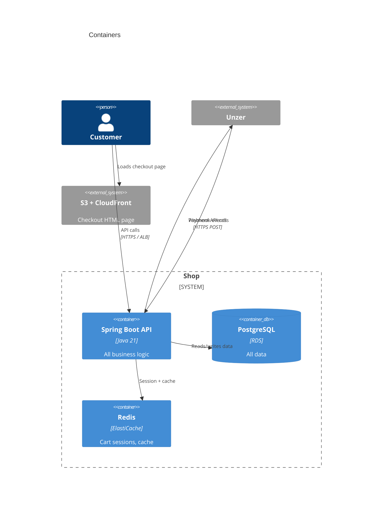
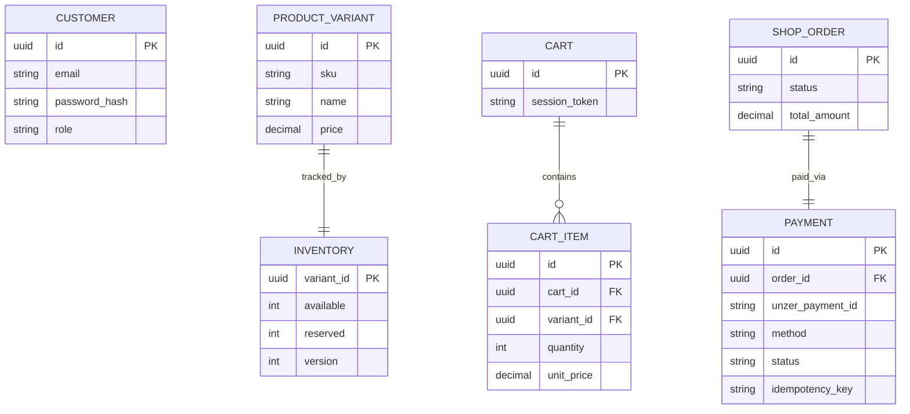
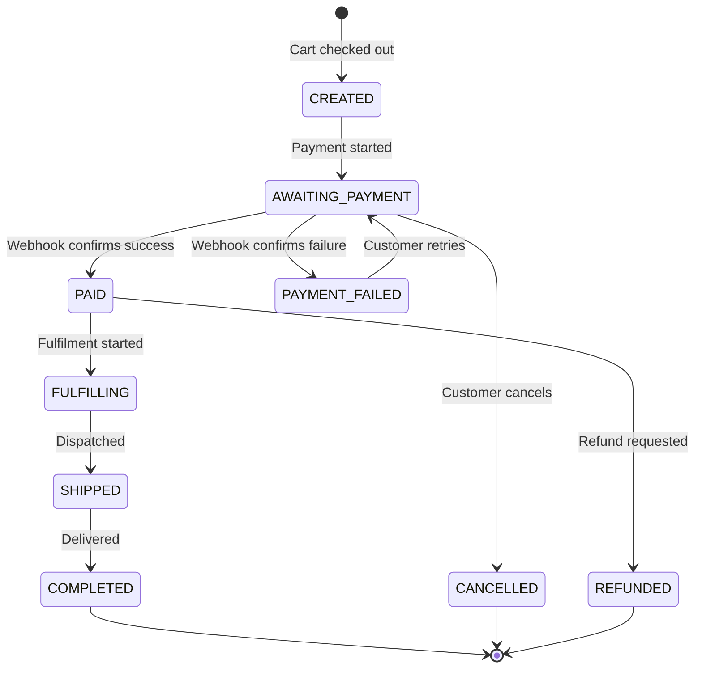
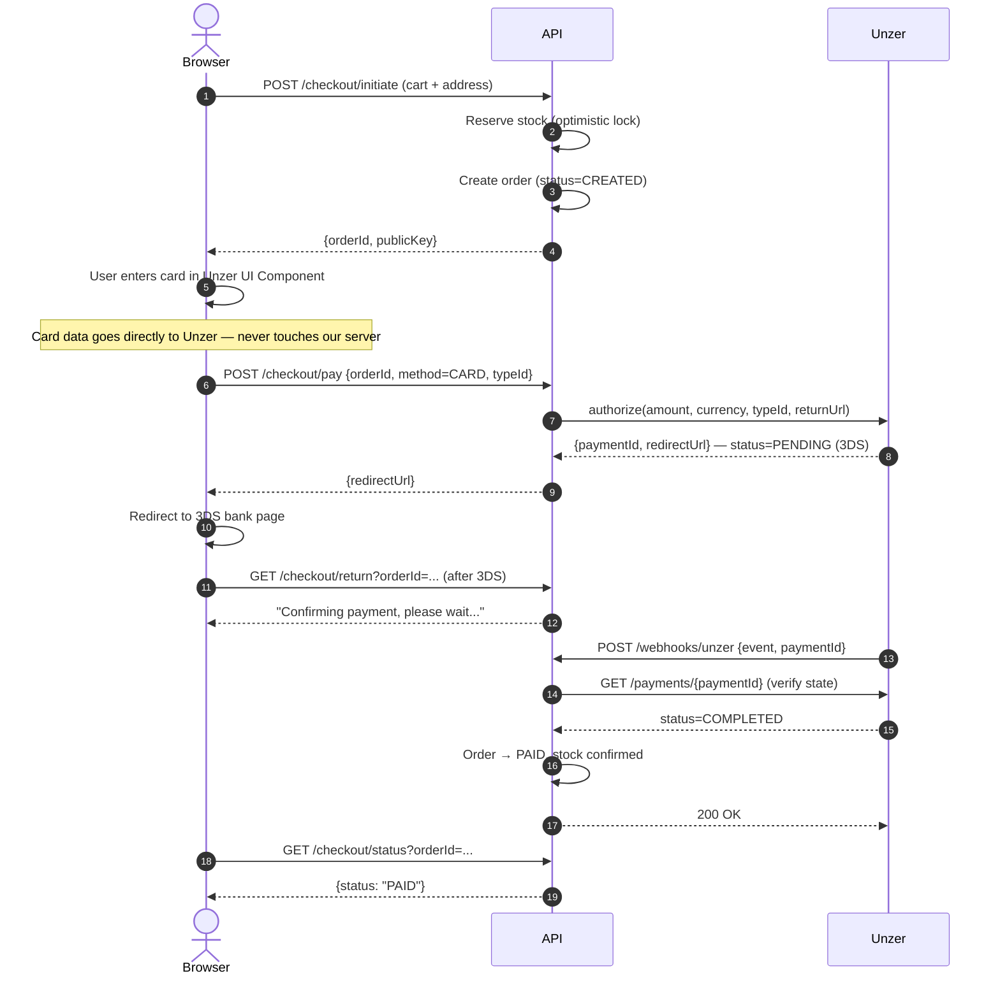
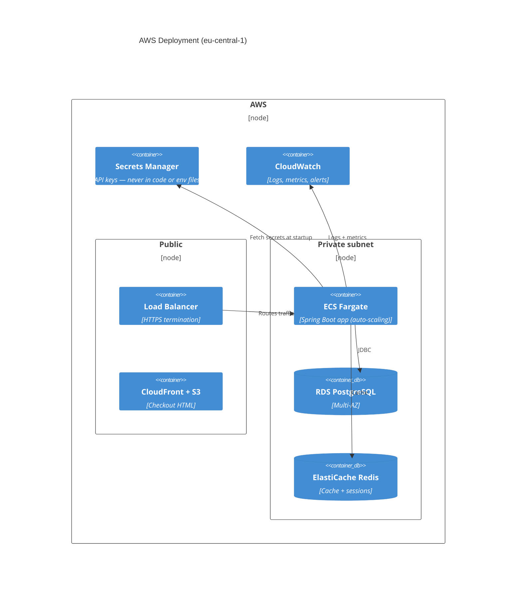

# E-Commerce Shop — Architecture Document

## 1. What This Is

An online shop backend where customers can browse products, add to cart, and pay using **Unzer** (credit card, Wero, or Open Banking). The backend handles everything: products, stock, orders, and payments.

**What's real vs stubbed:**
- Real: checkout flow, Unzer payment (Card + Wero), webhook receiver, stock reservation
- Stubbed: email notifications, full admin UI, multi-currency

**Assumptions:**
- EUR only
- Guest checkout allowed (no account required)
- Stock reservation held for 15 minutes, then released automatically

---

## 2. How the System Is Split

Instead of one big app or many microservices, I chose a **modular monolith** — a single deployable Spring Boot app split into clear internal modules. Each module owns its own data and talks to others through Java interfaces only.

**Why not microservices?** They add a lot of complexity (network calls, distributed transactions) for problems that don't need it yet. The code is structured so individual modules can be extracted later if needed.

| Module | What it does |
|---|---|
| `catalog` | Products and variants |
| `inventory` | Stock levels, reservations |
| `cart` | Shopping cart |
| `order` | Order lifecycle |
| `payment` | Unzer integration |
| `customer` | Login, registration |

### C4 Context Diagram



### C4 Container Diagram



---

## 3. Data Model (Key Tables)



**Key decisions:**
- Money stored as `DECIMAL(19,4)` — never float
- `INVENTORY.version` is used for optimistic locking (explained in §5)
- `PAYMENT.idempotency_key` = `orderId + method`, unique in DB — prevents double-charging if anything retries
- `unzer_payment_id` is how we match Unzer webhooks back to our orders

---

## 4. Checkout & Payment Flow

### Order States



### Checkout Sequence (Credit Card example)



**Why not confirm on the return URL?** The redirect can arrive before Unzer has finished processing. The webhook is the reliable signal — always fetch the real state from Unzer before acting.

### Payment Methods

All three methods go through one `PaymentGateway` interface. Adding a fourth method means writing one new class.

| Method | Flow |
|---|---|
| **Credit Card** | typeId from UI Component → `authorize()` → 3DS redirect → webhook |
| **Wero** | Create Wero resource → `charge()` → redirect → webhook |
| **Open Banking** | Create OpenBanking resource → `charge()` → redirect to bank → webhook |

---

## 5. The Two Hard Problems

### Overselling (two people buying the last item)

When a customer checks out, we run this DB update atomically:

```sql
UPDATE inventory
SET available = available - :qty,
    reserved  = reserved  + :qty,
    version   = version   + 1
WHERE variant_id = :id
  AND version    = :expectedVersion   -- fails if someone else updated first
  AND available  >= :qty              -- fails if not enough stock
```

If `rowsUpdated = 0`, another buyer got there first or stock ran out. We retry up to 3 times, then return an "out of stock" error. A background job releases reservations that haven't converted to paid orders within 15 minutes.

### Keeping order + stock + payment consistent

**The problem:** any step can fail independently — Unzer can time out, our DB can fail mid-write, a webhook can arrive twice.

**The approach:**
1. The webhook handler saves the raw event to DB first (audit trail, never lost)
2. It then fetches the real payment state from Unzer (don't trust the event name)
3. All state transitions are idempotent — running them twice gives the same result
4. `PAYMENT.idempotency_key` unique constraint stops any duplicate charges at the DB level

**Failure examples:**

| What fails | Recovery |
|---|---|
| Order update fails after payment succeeds | Unzer retries webhook; idempotency key means no double charge; order transitions on retry |
| Webhook arrives before redirect | Webhook processes first, sets order PAID. Redirect handler just reads current status |
| Unzer times out mid-charge | Order stays AWAITING_PAYMENT; background poller fetches Unzer state every 30s |
| Reservation expires after payment | Expiry job checks order status first; PAID orders skip release |

---

## 6. Tech Choices

| Choice | Why |
|---|---|
| **Java 21 + Spring Boot 3** | LTS, virtual threads, mature ecosystem |
| **Unzer Java SDK 5.2.0** | Official SDK, handles auth and serialization |
| **PostgreSQL** | ACID transactions needed for stock + order consistency |
| **Flyway** | All schema changes versioned, reproducible |
| **JWT (stateless)** | Simple, no session store needed |
| **H2 (dev profile)** | Zero-setup local run without Docker |

---

## 7. AWS Deployment



**Secrets:** Unzer private key stored in Secrets Manager only. The ECS task fetches it at startup. Never in code, never in `.env` files committed to git.

**Scaling:** Catalog reads are cached in Redis + CloudFront. Checkout writes go to the primary DB. ECS tasks scale horizontally behind the ALB.

---

## 8. Security

- **No card data on our server** — Unzer UI Components handle card input in the browser and return only a token (`typeId`). We never see the card number. This keeps us out of PCI scope.
- **JWT auth** — stateless, signed tokens for customer and admin roles
- **API key** — loaded from Secrets Manager at runtime, never hardcoded
- **HTTPS everywhere** — ALB enforces HTTPS, rejects plain HTTP

---

## 9. Trade-offs & What I'd Do With More Time

| Decision | Trade-off |
|---|---|
| Modular monolith | Simpler now; individual modules can be extracted into services later |
| Optimistic locking | Works well at normal load; under extreme flash-sale concurrency a queue-based checkout would be more reliable |
| Webhook-only confirmation | Slightly slower UX (customer waits a second); correct and reliable |
| H2 for local dev | Quick to get started; switch to Postgres with one flag for real testing |

**With more time:** proper integration tests with Testcontainers, a reconciliation job that compares our payment records with Unzer's nightly, and a circuit breaker around Unzer API calls.
