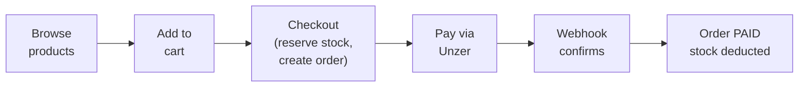
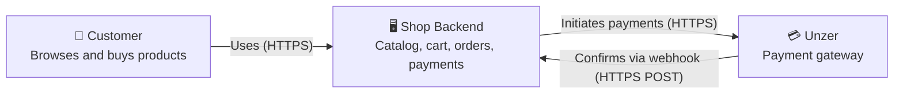
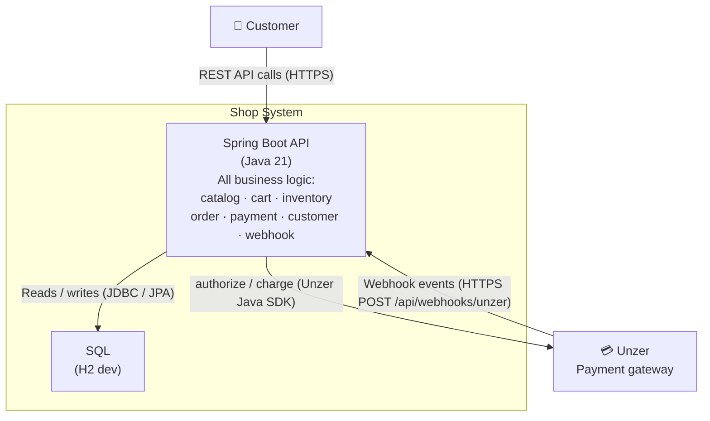
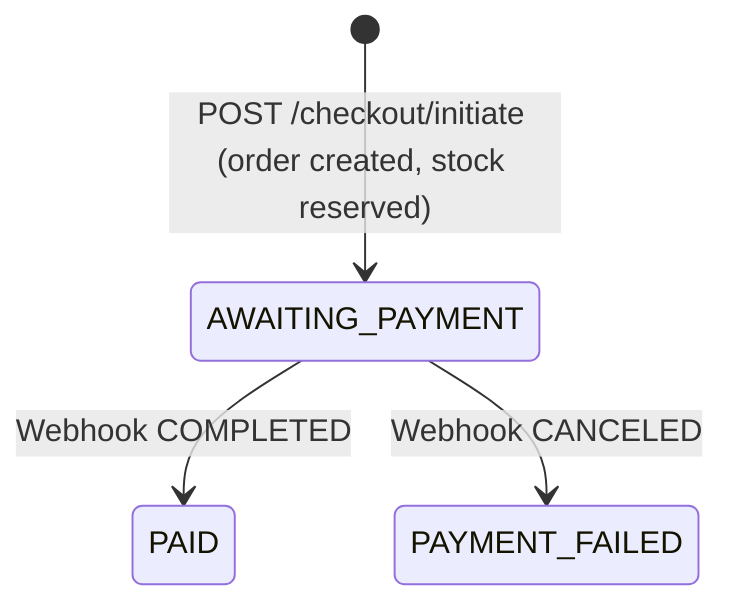
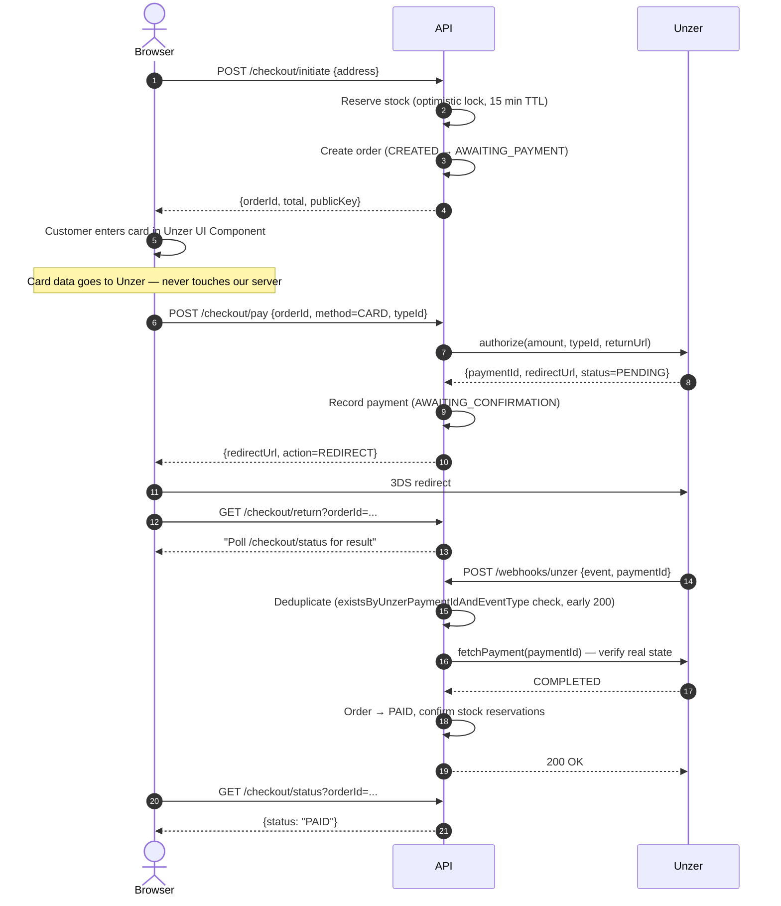
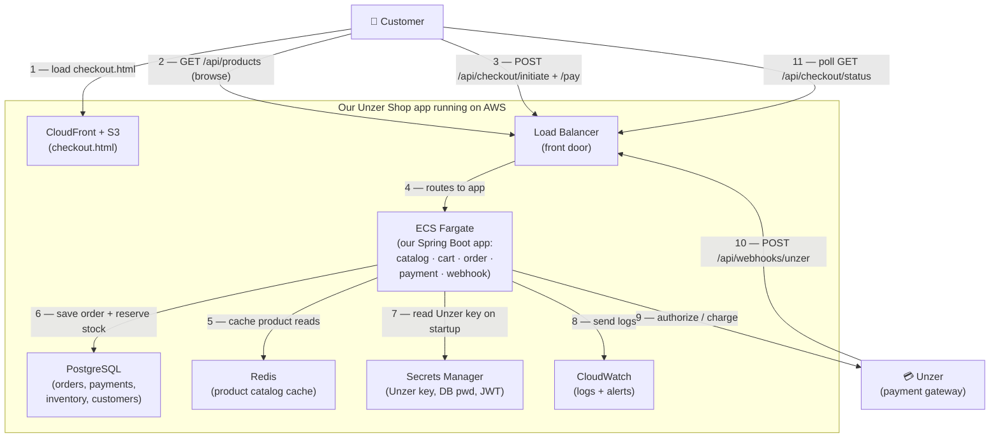

# Unzer E-Commerce Shop — Architecture

A customer browses products, adds them to a cart, and checks out. At checkout the system **reserves the stock** (so no one else can grab the last unit), creates an **order**, and asks **Unzer** to take the payment. The customer pays (card details go straight to Unzer, never to us). Unzer then sends a **webhook** back to confirm the money arrived — only then does the order become `PAID` and the reserved stock is permanently deducted. If payment fails or times out, the reserved stock is released back.



---

## 2. Module Layout

One deployable Spring Boot app split into eight packages. Each package owns its own models, repositories, and services. Modules talk to each other only through injected Spring beans — no HTTP calls between them.

| Module | What it does |
|---|---|
| `catalog` | Products and variants — read-only |
| `inventory` | Stock levels, reservations, oversell prevention |
| `cart` | Shopping cart per session token |
| `order` | Order lifecycle and status transitions |
| `payment` | Unzer gateway integration, checkout orchestration |
| `customer` | Registration, login, JWT tokens |
| `webhook` | Receives Unzer webhook events; `WebhookRegistrar` auto-registers the endpoint with Unzer on startup |
| `common` | Security config, JWT filter, global error handling |

### Level 1 — System Context
*(Who uses the system and what external systems does it talk to?)*



### Level 2 — Container Diagram
*(What deployable units make up the system and how do they communicate?)*




---

## 3. Data Model


**Key decisions:**
- Money stored as `DECIMAL(19,4)` — never float.
- `INVENTORY.version` enables optimistic locking (see §5).
- `PAYMENT.idempotency_key = orderId + ":" + method` — `PaymentService.initiate` looks up this key first (`findByIdempotencyKey(...).orElseGet(...)`) and returns the existing payment on a retry instead of calling Unzer again, which is what prevents double-charging. The unique DB constraint is a backstop against duplicate payment rows under concurrency.
- `PAYMENT.unzer_charge_id` — stored at initiation for Wero and Open Banking; used when processing refunds.
- `PAYMENT_EVENT(unzer_payment_id, event_type)` — unique constraint is a backstop; the webhook handler dedupes with an explicit existence check before insert (see §5).

---

## 4. Checkout & Payment Flow

### Order states

Only transitions with actual code implementations are shown.



The order starts as `CREATED`, then flips to `AWAITING_PAYMENT` once stock is reserved within the same `/checkout/initiate` call — both steps logged in `order_status_history`.

Other states (`FULFILLING`, `SHIPPED`, `COMPLETED`, `CANCELLED`) exist in the enum but aren't wired to any endpoint yet. `REFUNDED` has working code (`PaymentService.refund(...)`) but nothing calls it, so it can't be triggered at runtime.

### Request sequence (Credit Card example)



### Payment methods

All three implement the same `PaymentGateway` interface (`initiate` + `refund`)

| Method | Flow | chargeId available at initiation? |
|---|---|---|
| **Credit Card** | `authorize()` → 3DS redirect → webhook | No (authorize flow, no charge yet) |
| **Wero** | `charge()` → redirect → webhook | Yes |
| **Open Banking** | `charge()` → redirect to bank → webhook | Yes |

---

## 5. The Two Hard Problems

### Overselling

`InventoryService.reserve()` runs one atomic DB update:

```sql
UPDATE inventory
SET available = available - :qty,
    reserved  = reserved  + :qty,
    version   = version   + 1
WHERE variant_id = :variantId
  AND version    = :expectedVersion  -- fails if another transaction updated first
  AND available  >= :qty             -- fails if not enough stock
```

One single update lowers `available`, raises `reserved`, and bumps `version` — but **only if** the version is unchanged and stock is enough. If it updates 0 rows:
- **Someone grabbed it first** (version changed) → retry 3×, then `ConcurrentReservationException`.
- **Not enough stock** → caught before the update, throws `InsufficientStockException` immediately.

A background job every 60 seconds frees stock still `RESERVED` past its expiry (abandoned carts). Paid orders are `CONFIRMED`, so it leaves them alone.

### Idempotency and consistency

Any step can fail on its own

| What can go wrong | How we handle it |
|---|---|
| Same webhook twice | Check if we've seen this event; if yes, skip and return 200 (DB unique rule is the backup) |
| Webhook arrives before browser returns | Webhook sets order to PAID first; the return page just reads current status |

---

## 6. Data Ownership

Each module owns its tables exclusively. No module queries another module's tables directly — cross-module access goes through the owning module's service.

| Module | Tables it owns | Referenced by |
|---|---|---|
| `catalog` | `product`, `product_variant` | `inventory`, `cart` (by `variant_id`) |
| `inventory` | `inventory`, `reservation` | `payment` (via `InventoryService`) |
| `cart` | `cart`, `cart_item` | `payment/CheckoutService` |
| `order` | `shop_order`, `order_line`, `order_status_history` | `payment` (via `OrderService`) |
| `payment` | `payment`, `payment_event` | `webhook` (via `PaymentService`) |
| `customer` | `customer` | `order` (by `customer_id`), `cart` (by `customer_id`) |


---

## 7. Sync vs. Async

**Sync** = "wait for the answer right now." **Async** = "do it in the background, no one is waiting."

| Interaction | Style | Why |
|---|---|---|
| Customer → API (browse, cart, checkout) | **Sync** | Customer is staring at the screen — answer immediately |
| API → Unzer (authorize / charge) | **Sync** | We need the payment link back *now* to show the customer |
| Unzer → API (webhook) | **Async** | Unzer sends it whenever it's ready; we just accept it and reply 200 |
| Browser checking `/checkout/status` | **Sync (repeated)** | The page asks "done yet?" every few seconds — simple, no fancy live connection |
| Expiry job (free stale stock) | **Async (scheduled)** | Runs every 60s in the background; nobody is waiting on it |

---

## 8. Tech Stack

| Choice | Why |
|---|---|
| Java 21 + Spring Boot 3 | LTS, virtual threads, mature ecosystem |
| Unzer Java SDK 5.2.0 | Official SDK — handles auth, serialization, and Unzer API details |
| PostgreSQL | ACID transactions required for stock + order consistency |
| Flyway | Schema changes versioned and reproducible (V1 initial schema, V2 fixes, V3 cleanup) |
| JWT (stateless) | No session store needed |
| H2 (dev profile) | Zero-setup local run — switch to Postgres with `--spring.profiles.active=postgres` |

---

## 9. AWS Deployment (planned)

Think of it like this: the app is packed into a Docker container and handed to AWS to run. AWS takes care of starting it, keeping it alive, and scaling it up when traffic grows.



**Scaling — two different problems:**

- **Browsing** (`GET /api/products`) — huge traffic, same data → CloudFront + Redis cache absorb it; most requests never hit the app.
- **Checkout** (`POST /checkout`) — fewer requests, each writes to DB → run more ECS copies behind the ALB.

**CI/CD** (`.github/workflows/ci-cd.yml`): push → tests run on H2 → build Docker image → push to ECR → approve → ECS rolling deploy (zero downtime).

**ECS task definition** (`infra/ecs-task-definition.json`): defines how the container runs on Fargate — CPU/memory, port, CloudWatch logging, health check, and the Secrets Manager references that get injected at startup.

**Secrets:** Unzer key, DB password, JWT secret live in Secrets Manager; ECS pulls them at startup — never in code or logs.

**Observability:** every log line carries `orderId`/`paymentId`; CloudWatch alerts if payment failures exceed 5% or checkout is slower than 2s.

---

## 10. Security

- **No card data on our server** — Unzer UI Components take the card in the browser and return only a `typeId` token. We never see the card number → out of PCI scope.
- **JWT auth** — public (no token): cart, checkout, product browsing, auth, webhooks, health, static files. Everything else needs a valid token.
- **Roles** — `role` is in the JWT, but admin-path enforcement (`@PreAuthorize`) isn't wired yet.
- **API key** — from Secrets Manager at runtime, never hardcoded.
- **HTTPS everywhere** — ALB rejects plain HTTP.

---

## 11. Trade-offs & What's Not Built

| Decision | Trade-off |
|---|---|
| Modular monolith | Simpler now; each module can be split into a service later |
| Optimistic locking | Great at normal load; a queue would beat it in an extreme flash sale |
| Webhook-only confirmation | Slightly slower UX (customer polls) but kills the redirect-before-webhook race |
| Single shared DB | No distributed transactions; can split per-module later |
| No card refunds yet | Card uses `authorize` (no charge ID); refund needs a capture step first |

**Not built (by design):**
- Product categories & search
- Full order lifecycle (`FULFILLING → SHIPPED → COMPLETED`)
- Admin role enforcement (`@PreAuthorize` guards)
- Cart availability check at add-time (checked at checkout instead)
- Email notifications

