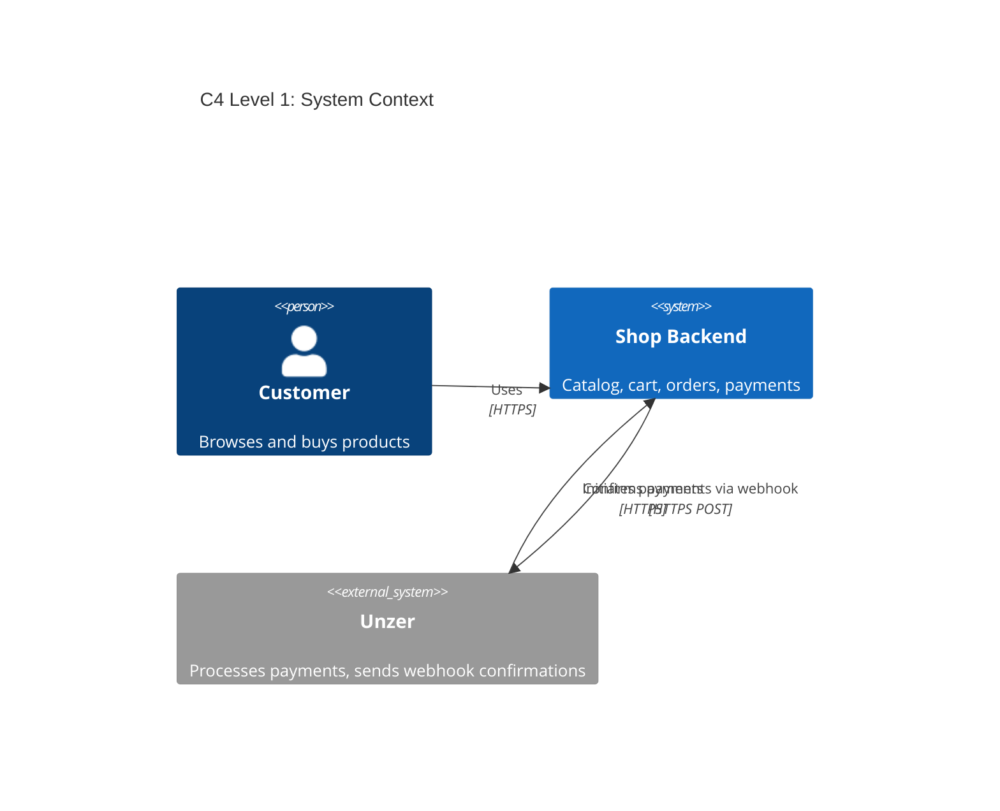
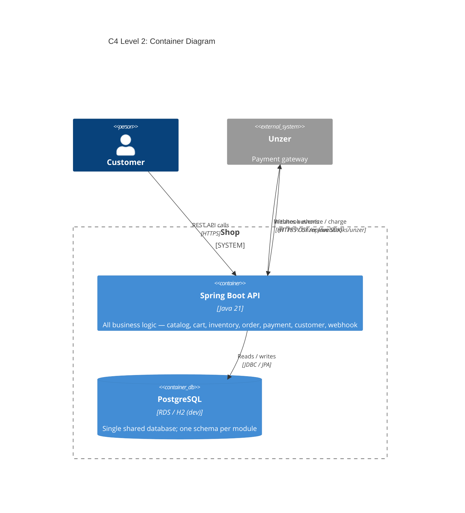
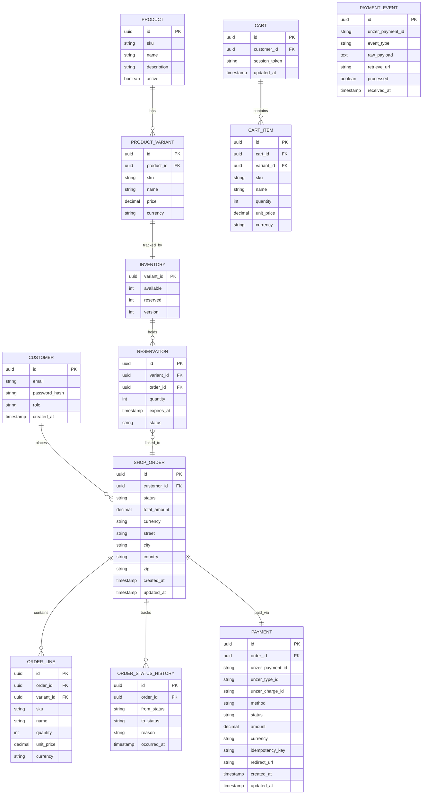
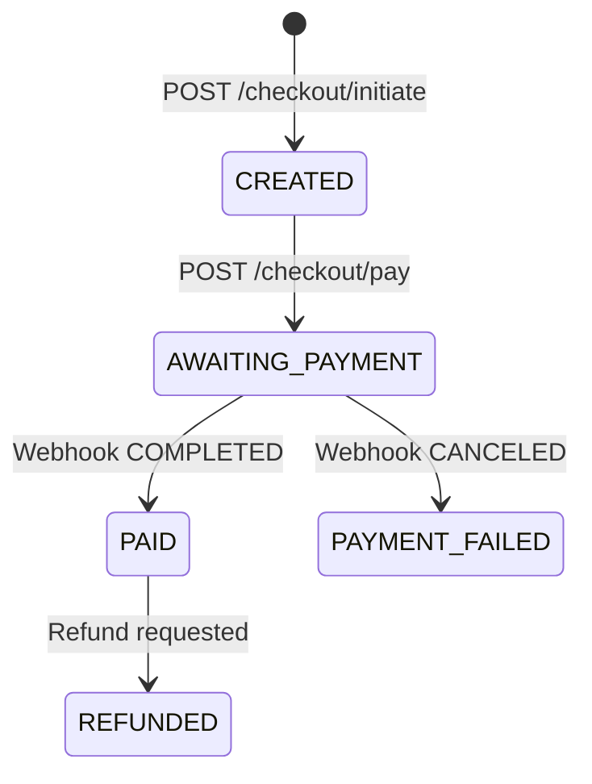
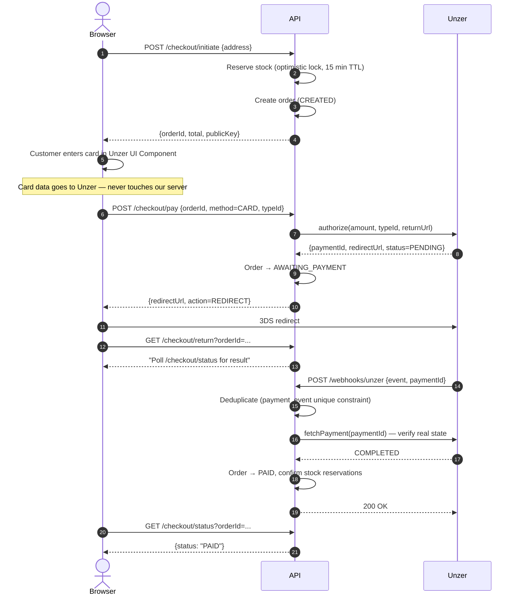
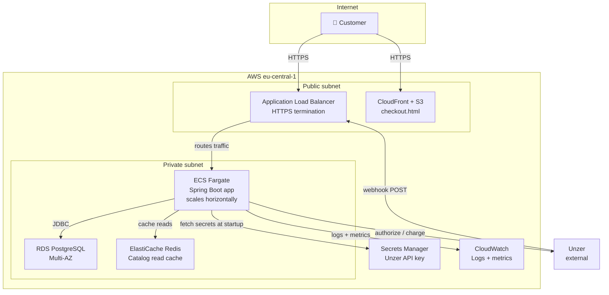

# E-Commerce Shop — Architecture

## 1. What This Is

A Spring Boot backend for an online shop. Customers can browse products, add items to a cart, and pay using Unzer (Credit Card, Wero, or Open Banking).

**In scope:** product catalog, cart, stock reservation, order lifecycle, Unzer payment, webhook processing.  
**Out of scope:** email notifications, admin UI, multi-currency (EUR only).  
**Guest checkout is allowed** — no account required, cart is keyed by a session token.

---

## 2. Module Layout

One deployable Spring Boot app split into eight packages. Each package owns its own models, repositories, and services. Modules talk to each other only through injected Spring beans — no HTTP calls between them.

| Module | What it does |
|---|---|
| `catalog` | Products and variants — read-only |
| `inventory` | Stock levels, reservations, oversell prevention |
| `cart` | Shopping cart per session token |
| `order` | Order lifecycle and status transitions |
| `payment` | Unzer gateway integration, checkout orchestration |
| `customer` | Registration, login, JWT tokens |
| `webhook` | Receives Unzer webhook events; `WebhookRegistrar` auto-registers the endpoint with Unzer on startup |
| `common` | Security config, JWT filter, global error handling |

### C4 Level 1 — System Context
*(Who uses the system and what external systems does it talk to?)*



### C4 Level 2 — Container Diagram
*(What deployable units make up the system and how do they communicate?)*



**Why a single database?** All modules live in one process and share one PostgreSQL instance. Separate databases per module would require distributed transactions (two-phase commit or sagas) to keep order + inventory + payment consistent — significant complexity for no real benefit at this scale. Modules reference each other only by foreign key ID, never by joining across schemas.

---

## 3. Data Model



**Key decisions:**
- Money stored as `DECIMAL(19,4)` — never float.
- `INVENTORY.version` enables optimistic locking (see §5).
- `PAYMENT.idempotency_key = orderId + ":" + method` — unique DB constraint prevents double-charging on retries.
- `PAYMENT.unzer_charge_id` — stored at initiation for Wero and Open Banking; used when processing refunds.
- `PAYMENT_EVENT(unzer_payment_id, event_type)` — unique constraint silently drops duplicate webhooks.

---

## 4. Checkout & Payment Flow

### Order states

Only transitions with actual code implementations are shown.



Future states (`FULFILLING`, `SHIPPED`, `COMPLETED`, `CANCELLED`) are defined in the enum but not yet wired to any endpoint.

### Request sequence (Credit Card example)



### Payment methods

All three implement the same `PaymentGateway` interface (`initiate` + `refund`). Adding a new method means writing one new class.

| Method | Flow | chargeId available at initiation? |
|---|---|---|
| **Credit Card** | `authorize()` → 3DS redirect → webhook | No (authorize flow, no charge yet) |
| **Wero** | `charge()` → redirect → webhook | Yes |
| **Open Banking** | `charge()` → redirect to bank → webhook | Yes |

**Why confirm on the webhook, not the return URL?** The browser redirect can arrive before Unzer finishes processing. The webhook is the authoritative signal — the handler always re-fetches the real state from Unzer before acting.

---

## 5. The Two Hard Problems

### Overselling

`InventoryService.reserve()` runs one atomic DB update:

```sql
UPDATE inventory
SET available = available - :qty,
    reserved  = reserved  + :qty,
    version   = version   + 1
WHERE variant_id = :variantId
  AND version    = :expectedVersion  -- fails if another transaction updated first
  AND available  >= :qty             -- fails if not enough stock
```

If `rowsUpdated = 0`, a concurrent buyer won or stock ran out. The service retries up to 3 times, then throws `ConcurrentReservationException`. A `@Scheduled` job runs every 60 seconds and releases any reservation whose `status = 'RESERVED'` and `expires_at < now` — returning stock for abandoned carts. Reservations for paid orders are already `CONFIRMED`, so the job leaves them alone.

### Idempotency and consistency

Any step can fail independently — Unzer can time out, the DB can fail mid-write, a webhook can arrive twice.

| Failure | Recovery |
|---|---|
| Webhook arrives twice | `payment_event(unzer_payment_id, event_type)` unique constraint rejects the duplicate; handler returns 200 immediately |
| Webhook arrives before browser redirect | Webhook sets order to PAID first; `/checkout/return` just reads the current status |
| DB fails after payment succeeds | Unzer retries the webhook; `idempotency_key` constraint prevents double-charge; order transitions on retry |
| Reservation expires before payment completes | Expiry job releases it; `CONFIRMED` reservations are untouched |

Raw webhook payloads are saved to `payment_event` before any processing — audit trail that can be replayed if processing fails.

---

## 6. Data Ownership

Each module owns its tables exclusively. No module queries another module's tables directly — cross-module access goes through the owning module's service.

| Module | Tables it owns | Referenced by |
|---|---|---|
| `catalog` | `product`, `product_variant` | `inventory`, `cart` (by `variant_id`) |
| `inventory` | `inventory`, `reservation` | `payment` (via `InventoryService`) |
| `cart` | `cart`, `cart_item` | `payment/CheckoutService` |
| `order` | `shop_order`, `order_line`, `order_status_history` | `payment` (via `OrderService`) |
| `payment` | `payment`, `payment_event` | `webhook` (via `PaymentService`) |
| `customer` | `customer` | `order` (by `customer_id`), `cart` (by `customer_id`) |

Cross-module references are by ID only — e.g. `payment.order_id` is a plain UUID column, not a JPA `@ManyToOne` join to `Order`. This means each module can evolve its schema independently without breaking others.

---

## 7. Sync vs. Async

| Interaction | Style | Why |
|---|---|---|
| Customer → API (browse, cart, checkout) | **Synchronous REST** | Customer is waiting; latency matters; simple request/response |
| API → Unzer (authorize / charge) | **Synchronous HTTPS** | We need the `paymentId` and `redirectUrl` immediately to respond to the customer |
| Unzer → API (webhook) | **Asynchronous HTTP POST** | Unzer fires it independently; we process it and return 200 — the customer polls separately |
| Browser polling `/checkout/status` | **Synchronous short-poll** | Simple; avoids WebSocket complexity for a one-time status check |
| Expiry job (release stale reservations) | **Async scheduled** | Background concern; 60-second granularity is fine; no customer is waiting |

**Why not a message queue (Kafka/SQS) between modules?** All modules are in one process — there is no network boundary to bridge. Adding a broker would introduce ordering guarantees, consumer groups, and dead-letter queues for a problem that a DB transaction already solves atomically. If modules are ever extracted into separate services, the `payment_event` table is already an outbox-style audit log that could feed a queue at that point.

---

## 8. Tech Stack

| Choice | Why |
|---|---|
| Java 21 + Spring Boot 3 | LTS, virtual threads, mature ecosystem |
| Unzer Java SDK 5.2.0 | Official SDK — handles auth, serialization, and Unzer API details |
| PostgreSQL | ACID transactions required for stock + order consistency |
| Flyway | Schema changes versioned and reproducible (V1 initial schema, V2 fixes, V3 cleanup) |
| JWT (stateless) | No session store needed |
| H2 (dev profile) | Zero-setup local run — switch to Postgres with `--spring.profiles.active=postgres` |

---

## 9. AWS Deployment (planned)



**Scaling strategy — load concentrates in two very different places:**

| Path | Characteristic | How to scale |
|---|---|---|
| Catalog reads (`GET /api/products/**`) | High volume, read-only, cacheable | CloudFront CDN in front of API; Redis cache for product/variant queries; read replicas on RDS |
| Checkout writes (`POST /checkout/**`) | Low volume, stateful, DB-heavy | Horizontal ECS task scaling behind ALB; connection pooling (HikariCP); optimistic locking avoids held row locks that would serialise writes |
| Webhook events | Bursty, idempotent | Stateless handler — any ECS task can process any webhook; duplicate-safe via unique constraint |

- **Secrets:** Unzer private key in Secrets Manager only — never in code or `.env` files.
- **CI/CD:** PR → tests on H2 → merge → Docker image pushed to ECR → rolling ECS deploy. Production requires a manual approval gate.
- **Observability:** structured JSON logs with `orderId`/`paymentId` on every line; CloudWatch metrics for `payment.succeeded`, `payment.failed`, `stock.reservation.failed`; alarm if payment failure rate exceeds 5% or checkout P99 latency exceeds 2s.

---

## 10. Security

- **No card data on our server** — Unzer UI Components handle card input in the browser and return only a `typeId` token. We never see the card number; this keeps the app out of PCI scope.
- **JWT auth** — stateless signed tokens; guest checkout endpoints (`/api/checkout/**`) are public; all other endpoints require a valid token.
- **Customer vs admin roles** — `role` column on `Customer`; `SecurityConfig` restricts admin paths to `ADMIN` role. Admin catalog CRUD endpoints are designed but not fully wired in the vertical slice.
- **API key** — loaded from Secrets Manager at runtime, never hardcoded.
- **HTTPS everywhere** — ALB rejects plain HTTP.

---

## 11. Trade-offs & What's Not Built

| Decision | Trade-off |
|---|---|
| Modular monolith | Simpler than microservices now; each module can be extracted into its own service later if needed |
| Optimistic locking | Works well at normal load; under extreme flash-sale concurrency a queue-based checkout would be more reliable |
| Webhook-only confirmation | Slightly slower UX — customer polls for final status; eliminates the redirect-before-webhook race condition |
| Single shared DB | No distributed transactions needed; modules can be split with their own DB later if they need to scale independently |
| Card refunds not yet supported | Card uses `authorize` (no charge ID at initiation); refund throws clearly if attempted — needs a capture step wired first |

**Not built in the vertical slice (by design):**
- Product categories and search — catalog read model is there; category table and search endpoint not added
- Full order lifecycle transitions (`FULFILLING → SHIPPED → COMPLETED`) — states are defined in the enum; no fulfilment service wired
- Admin role enforcement on catalog CRUD endpoints — role distinction exists in JWT; `@PreAuthorize` guards not yet applied
- Cart availability check at add-item time — stock checked at checkout reservation, not at cart add
- Email notifications — stubbed (no SES wiring)

**With more time:** Testcontainers integration tests, a nightly reconciliation job comparing our payment records against Unzer's API, and a circuit breaker around Unzer API calls.
