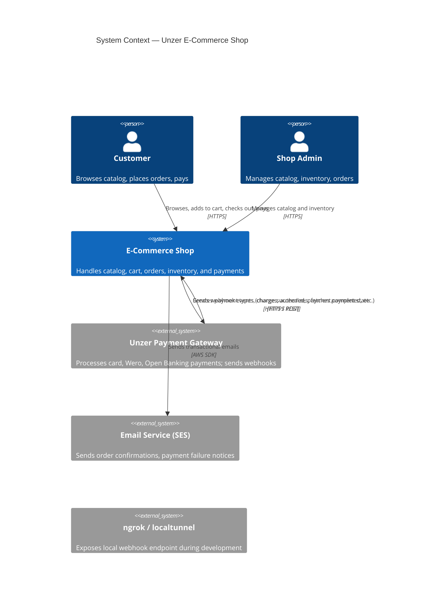
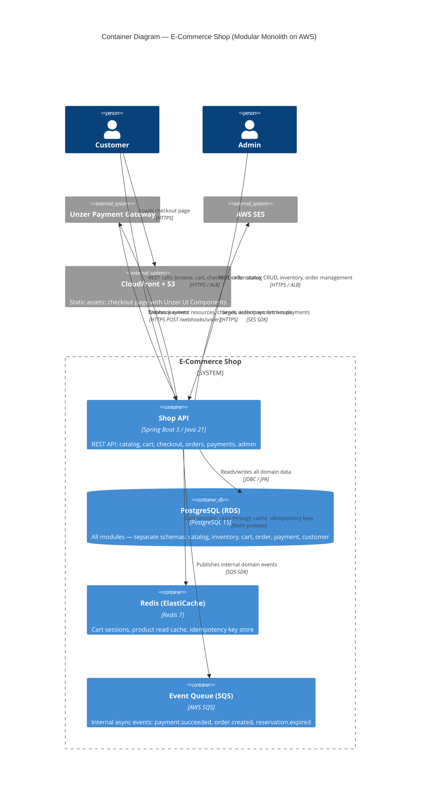
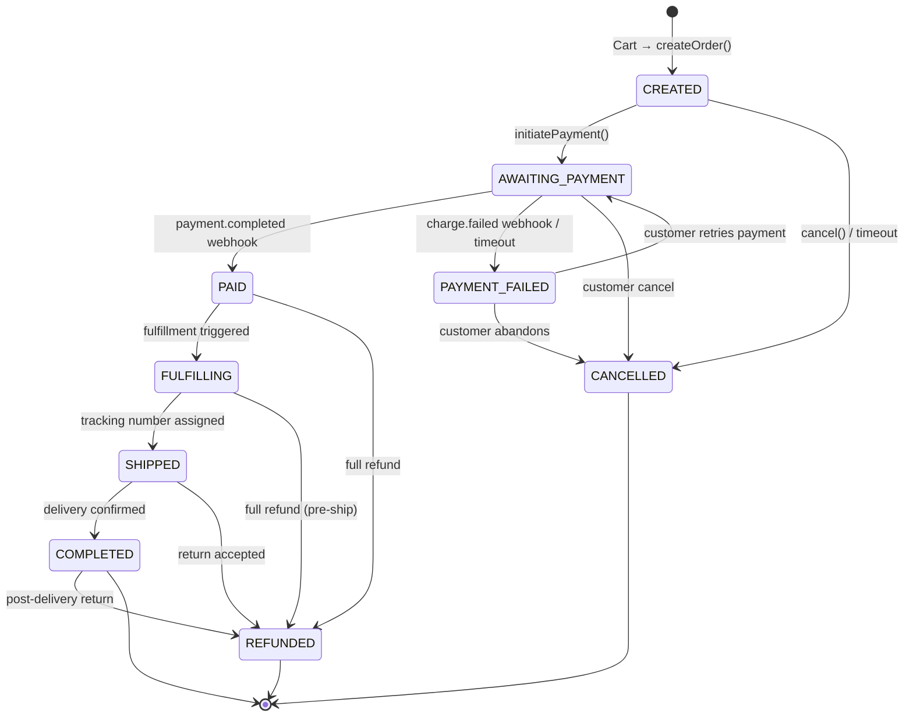
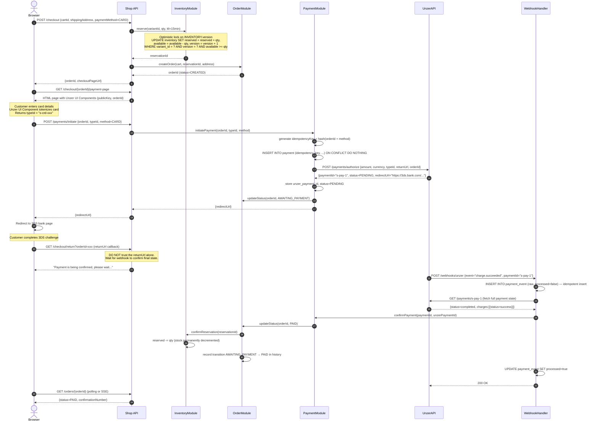

# Architecture Document — Full E-Commerce Shop with Unzer Payments

---

## 1. Overview & Assumptions

This document describes the backend architecture for a full-featured e-commerce shop with Unzer as its payment subsystem. The architecture must handle catalog browsing, cart management, checkout, inventory reservation, and payment processing — while keeping these independently-operable parts consistent under failure.

**Scope boundaries:**
- Backend only; minimal frontend for checkout/payment flow (enough to demonstrate the Unzer UI Components tokenization)
- All three Unzer methods covered: Credit Card, Wero, Open Banking; fourth method can be added by implementing one interface
- Sandbox/test environment only — no real card data, no real money
- AWS deployment as the target platform

**What is real vs. mocked in the vertical slice:**
- Real: checkout → Unzer payment (Credit Card + Wero) → order confirmation → webhook receiver
- Stubbed: catalog, cart persistence (in-memory), inventory (in-memory with optimistic lock), customer auth (JWT with hardcoded test user), email notifications

**Assumptions made:**
- EUR-only currency for simplicity; multi-currency is a straightforward extension
- Guest checkout allowed; no account required
- Stock reservation TTL is 15 minutes
- A single deployment region (eu-central-1) is sufficient for the sandbox demo
- Modular monolith is the right starting point (see §2)

---

## 2. System Decomposition

### Modular Monolith, Not Microservices

The system is designed as a **modular monolith** — a single deployable unit internally divided into strict module boundaries. Each module owns its data (separate schema/tables), communicates with other modules through well-defined interfaces (Java interfaces, not HTTP calls), and can be extracted into a separate service later without changing the contracts.

**Why not microservices from the start?**
- The assignment asks for a working vertical slice in 4–8 hours; distributed transactions add operational complexity that obscures the interesting architectural problems
- The hardest part — keeping order/inventory/payment consistent — is actually *harder* to reason about across network boundaries at this stage
- A modular monolith makes the boundaries explicit without paying the distributed-systems tax prematurely
- Extraction path is clear: each module → its own Spring Boot app, internal interfaces → REST/gRPC contracts, in-process events → Kafka/SQS messages

**Module boundaries:**

| Module | Owns | Public contract |
|---|---|---|
| `catalog` | Products, variants, categories, prices | `CatalogService`: findProduct, listCategories, search |
| `inventory` | Stock levels per variant | `InventoryService`: reserve, release, confirm, getAvailable |
| `cart` | Cart items, session | `CartService`: addItem, removeItem, getCart, checkout |
| `order` | Orders, order lines, order state machine | `OrderService`: createOrder, updateStatus, getOrder |
| `payment` | Payment records, Unzer integration | `PaymentService`: initiatePayment, handleWebhook, refund |
| `customer` | Accounts, addresses, sessions | `CustomerService`: register, login, getProfile |
| `notification` | Email/SMS dispatch | `NotificationService`: sendOrderConfirmation, sendPaymentFailed |

Each module has its own package (`com.unzer.shop.<module>`), its own JPA entities, its own repository layer, and exposes only its service interface to other modules. Cross-module references use IDs, never JPA entity relationships across module boundaries.

### C4 Context Diagram



### C4 Container Diagram



---

## 3. Domain & Data Model

### Entity Overview

```mermaid
erDiagram
  CUSTOMER {
    uuid id PK
    string email UK
    string password_hash
    string role
    timestamp created_at
  }
  ADDRESS {
    uuid id PK
    uuid customer_id FK
    string street
    string city
    string country
    string zip
    boolean is_default
  }
  PRODUCT {
    uuid id PK
    string sku UK
    string name
    text description
    uuid category_id FK
    boolean active
  }
  PRODUCT_VARIANT {
    uuid id PK
    uuid product_id FK
    string sku UK
    jsonb attributes
    decimal price
    string currency
  }
  CATEGORY {
    uuid id PK
    string name
    uuid parent_id FK
  }
  INVENTORY {
    uuid variant_id PK FK
    int available
    int reserved
    int version
  }
  RESERVATION {
    uuid id PK
    uuid variant_id FK
    uuid order_id FK
    int quantity
    timestamp expires_at
    string status
  }
  CART {
    uuid id PK
    uuid customer_id FK
    string session_token
    timestamp updated_at
  }
  CART_ITEM {
    uuid id PK
    uuid cart_id FK
    uuid variant_id FK
    int quantity
    decimal unit_price
    string currency
  }
  ORDER {
    uuid id PK
    uuid customer_id FK
    string status
    decimal total_amount
    string currency
    uuid shipping_address_id FK
    timestamp created_at
    timestamp updated_at
  }
  ORDER_LINE {
    uuid id PK
    uuid order_id FK
    uuid variant_id FK
    int quantity
    decimal unit_price
    string currency
  }
  ORDER_STATUS_HISTORY {
    uuid id PK
    uuid order_id FK
    string from_status
    string to_status
    string reason
    timestamp occurred_at
  }
  PAYMENT {
    uuid id PK
    uuid order_id FK UK
    string unzer_payment_id UK
    string unzer_type_id
    string method
    string status
    decimal amount
    string currency
    string idempotency_key UK
    timestamp created_at
    timestamp updated_at
  }
  PAYMENT_EVENT {
    uuid id PK
    uuid payment_id FK
    string unzer_event_type
    jsonb raw_payload
    timestamp received_at
    boolean processed
  }

  CUSTOMER ||--o{ ADDRESS : has
  CUSTOMER ||--o{ ORDER : places
  PRODUCT ||--o{ PRODUCT_VARIANT : has
  PRODUCT }o--|| CATEGORY : belongs_to
  PRODUCT_VARIANT ||--|| INVENTORY : tracks
  INVENTORY ||--o{ RESERVATION : has
  CART ||--o{ CART_ITEM : contains
  ORDER ||--o{ ORDER_LINE : contains
  ORDER ||--o{ ORDER_STATUS_HISTORY : tracks
  ORDER ||--|| PAYMENT : paid_via
  PAYMENT ||--o{ PAYMENT_EVENT : receives
```

### Key Design Decisions

**Money representation:** All monetary amounts stored as `DECIMAL(19,4)` — never `FLOAT`. Java uses `BigDecimal` throughout. Currency stored as ISO 4217 string alongside every amount.

**Stock representation:** `INVENTORY` has `available` (unreserved) and `reserved` (held for pending orders) and a `version` column for optimistic locking. The invariant is: `available >= 0` and `reserved >= 0`.

**Idempotency:** The `PAYMENT` table has a unique `idempotency_key` (composed from `orderId + paymentMethod`). Any duplicate payment attempt for the same order returns the existing payment record. `PAYMENT_EVENT` stores all raw webhook payloads; the `processed` flag ensures at-least-once webhook delivery is handled exactly once.

**Unzer ID mapping:** `unzer_payment_id` (e.g. `s-pay-1`) and `unzer_type_id` (e.g. `s-crd-xxx`, `wro-xxx`, `opb-xxx`) stored on `PAYMENT`. The `unzer_payment_id` is the key used to reconcile webhooks.

**Order lifecycle:** Modelled as a strict state machine (see §4). All transitions recorded in `ORDER_STATUS_HISTORY` for full auditability.

---

## 4. Checkout & Payment Flow

### Order State Machine



### Checkout Sequence — Full Flow (Credit Card 3DS example)



### Unzer Resource/Transaction Model Abstraction

The three payment methods are unified behind a single `PaymentGateway` interface. Adding a fourth method requires implementing only this interface:

```java
public interface PaymentGateway {
    PaymentInitResult initiate(PaymentRequest request);   // returns redirectUrl if needed
    RefundResult refund(String unzerPaymentId, BigDecimal amount);
    PaymentState fetchState(String unzerPaymentId);
}
```

Each implementation handles the method-specific resource creation (Wero: `createPaymentType(new Wero())`, Open Banking: `createPaymentType(new OpenBanking("DE"))`, Card: typeId already provided by UI Component) and then delegates to `unzer.charge()` or `unzer.authorize()`.

---

## 5. Consistency & Failure Handling

### The Oversell Problem

**Mechanism: Optimistic locking with a database-level constraint**

```sql
UPDATE inventory
SET available = available - :qty,
    reserved  = reserved  + :qty,
    version   = version   + 1
WHERE variant_id = :variantId
  AND version    = :expectedVersion
  AND available  >= :qty
```

If `rowsUpdated == 0`, either the version changed (concurrent buyer) or stock is insufficient. The application retries once (re-reads the row), then returns a "stock unavailable" error to the customer. This is preferred over pessimistic locking (`SELECT FOR UPDATE`) because:
- It scales better under read-heavy catalog traffic
- Lock contention is short-lived (compare-and-swap, no held locks)
- The constraint `available >= qty` prevents oversell even under race conditions

**Reservation TTL:** A background job (Spring `@Scheduled`) runs every minute and releases expired reservations (`expires_at < NOW() AND status = 'RESERVED'`), returning stock to `available`. This handles abandoned checkouts.

**Concurrency safety guarantee:** Even if two requests pass the `available >= qty` check simultaneously, only one `UPDATE` will succeed because the `version` check serializes them at the database level.

### Keeping Order / Inventory / Payment Consistent

The consistency strategy is the **Transactional Outbox Pattern**:

1. Within a single DB transaction: write the order/payment state change AND an outbox event row
2. A separate polling process (or CDC with Debezium) reads unprocessed outbox events and publishes them to SQS
3. Downstream consumers (e.g. inventory confirmation, notification) process events idempotently

This guarantees that a state change and its downstream effects are never split by a crash — if the DB write succeeds, the event will eventually be published; if the DB write fails, no event is published.

**Why not distributed transactions (2PC/Saga)?**
- 2PC is unavailable across services with separate DBs and adds coordinator complexity
- Sagas are correct but require compensating transactions to be written for every step — the outbox pattern achieves the same guarantee with less ceremony inside a modular monolith

### Redirect vs. Webhook Reconciliation

The system **never trusts the redirect URL alone**. The return URL handler acknowledges receipt and returns a "pending" state to the browser. The definitive state update happens only when:

1. The webhook arrives and the payload is verified by fetching `retrieveUrl` from Unzer
2. If the webhook is delayed > 30 seconds, a background polling job fetches `GET /payments/{unzerPaymentId}` for orders in `AWAITING_PAYMENT` state

This handles the race condition where the redirect arrives before the webhook.

### Concrete Failure Walkthroughs

| Failure scenario | How the system recovers |
|---|---|
| **Payment succeeds, order update fails** | Webhook re-delivered by Unzer (retries for 24h). `PAYMENT_EVENT.processed=false` means the handler re-runs. Idempotency key on `PAYMENT` prevents double-insertion. Order transitions to PAID on second attempt. |
| **Webhook arrives before redirect** | Webhook handler processes first, sets order to PAID. When redirect arrives, the handler sees `status=PAID` and shows confirmation. No double processing because `processed` flag is checked. |
| **Unzer times out mid-charge** | `UnzerPaymentException` caught; order stays in `AWAITING_PAYMENT`. Background poller fetches payment state after 30s. If Unzer recorded the charge, payment is confirmed; if not, the reservation eventually expires and stock is released. |
| **Reservation expires after payment** | Reservation TTL cleanup job checks `status='RESERVED' AND expires_at < NOW()`. Before releasing, it checks whether a linked order exists in `AWAITING_PAYMENT` or `PAID`. PAID orders skip the release; only truly abandoned reservations are freed. |
| **Duplicate webhook** | `INSERT INTO payment_event ... ON CONFLICT (unzer_payment_id, event_type, unzer_event_id) DO NOTHING` — duplicate is silently dropped. The `processed` flag ensures even if inserted twice, processing runs once. |
| **Stock confirmed twice** | `INVENTORY.version` optimistic lock prevents double-decrement. Confirmation is idempotent: if `reservation.status == CONFIRMED` already, no-op. |

---

## 6. Technology Choices (Java)

### Frameworks & Libraries

| Choice | Rationale |
|---|---|
| **Java 21 + Spring Boot 3.3** | LTS release, virtual threads (Project Loom) for high-concurrency webhook handlers, Spring's mature ecosystem for web/data/security |
| **Unzer Java SDK 5.2.0** | Official SDK — handles Bearer token refresh, serialization, SDK headers. Direct HTTP only needed for features not yet in SDK. |
| **Spring Data JPA + Hibernate** | Standard ORM; optimistic locking via `@Version` maps directly to the oversell strategy |
| **PostgreSQL 15** | ACID transactions, `SELECT ... FOR UPDATE SKIP LOCKED` for outbox polling, `JSONB` for flexible attributes/webhook payloads |
| **Redis (Spring Data Redis)** | Cart session storage, idempotency key TTL, product read cache |
| **Spring Security + JWT** | Stateless auth; `ROLE_CUSTOMER` and `ROLE_ADMIN` enforced at controller layer |
| **Flyway** | Schema migrations — every table/index change is versioned and auditable |
| **Testcontainers** | Integration tests against real PostgreSQL and Redis — no mocks for DB layer |
| **Lombok** | Reduces boilerplate on entities and DTOs |

### Representative Code — The Trickiest Part (Oversell + Outbox)

The most complex part is the checkout transaction: reserve stock, create order, and write an outbox event atomically.

```java
@Service
@Transactional
public class CheckoutService {

    public CheckoutResult checkout(UUID cartId, CheckoutRequest req) {
        Cart cart = cartRepository.findById(cartId).orElseThrow();

        // 1. Reserve stock for every line — optimistic lock, throws if insufficient
        List<UUID> reservationIds = cart.getItems().stream()
            .map(item -> inventoryService.reserve(
                item.getVariantId(), item.getQuantity(), Duration.ofMinutes(15)
            ))
            .toList();

        // 2. Create order (status=CREATED) — same transaction
        Order order = orderService.createOrder(cart, req.getShippingAddress(), reservationIds);

        // 3. Write outbox event — guarantees downstream notification even if caller crashes
        outboxRepository.save(OutboxEvent.of("order.created", order.getId()));

        return new CheckoutResult(order.getId());
    }
}

@Service
public class InventoryService {

    @Transactional
    public UUID reserve(UUID variantId, int qty, Duration ttl) {
        int attempts = 0;
        while (attempts++ < 3) {
            Inventory inv = inventoryRepository.findByVariantId(variantId);
            if (inv.getAvailable() < qty) throw new InsufficientStockException(variantId);

            int updated = inventoryRepository.reserveOptimistic(
                variantId, qty, inv.getVersion()
            );
            if (updated == 1) {
                return reservationRepository.save(
                    Reservation.builder()
                        .variantId(variantId).quantity(qty)
                        .expiresAt(Instant.now().plus(ttl))
                        .status(ReservationStatus.RESERVED)
                        .build()
                ).getId();
            }
            // version conflict — retry
        }
        throw new ConcurrentReservationException(variantId);
    }
}

// Repository — native query for atomic CAS update
@Query(value = """
    UPDATE inventory
    SET available = available - :qty,
        reserved  = reserved  + :qty,
        version   = version   + 1
    WHERE variant_id = :variantId
      AND version    = :expectedVersion
      AND available  >= :qty
    """, nativeQuery = true)
@Modifying
int reserveOptimistic(UUID variantId, int qty, int expectedVersion);
```

---

## 7. Deployment & DevOps (AWS)

### AWS Deployment Topology

```mermaid
C4Deployment
  title Deployment Diagram — AWS eu-central-1

  Deployment_Node(internet, "Internet") {
    Person(user, "Customer / Admin")
  }

  Deployment_Node(aws, "AWS eu-central-1") {
    Deployment_Node(cf, "CloudFront") {
      Container(cdn_dist, "CDN Distribution", "Static checkout HTML/JS assets from S3")
    }

    Deployment_Node(vpc, "VPC (private subnets)") {
      Deployment_Node(alb_node, "Public Subnet") {
        Container(alb, "Application Load Balancer", "HTTPS termination, path routing")
      }

      Deployment_Node(app_node, "App Subnet (private)") {
        Container(ecs, "ECS Fargate", "Spring Boot app containers (2–10 tasks, auto-scaling)")
      }

      Deployment_Node(data_node, "Data Subnet (isolated)") {
        ContainerDb(rds, "RDS PostgreSQL Multi-AZ", "Primary + standby replica, automated backups")
        ContainerDb(redis, "ElastiCache Redis", "Cart sessions, cache, idempotency keys")
      }

      Deployment_Node(async_node, "Messaging") {
        Container(sqs, "SQS FIFO Queues", "order-events.fifo, payment-events.fifo")
        Container(dlq, "SQS Dead Letter Queues", "Failed messages for investigation")
      }
    }

    Deployment_Node(support, "Supporting Services") {
      Container(ecr, "ECR", "Docker image registry")
      Container(sm, "Secrets Manager", "UNZER_PRIVATE_KEY and other secrets — never in env vars or code")
      Container(cw, "CloudWatch", "Logs, metrics, alarms, X-Ray distributed tracing")
      Container(ses_node, "SES", "Transactional email")
    }
  }

  Rel(user, cf, "HTTPS")
  Rel(cf, alb, "HTTPS")
  Rel(alb, ecs, "HTTP (internal)")
  Rel(ecs, rds, "JDBC")
  Rel(ecs, redis, "Redis protocol")
  Rel(ecs, sqs, "SQS SDK")
  Rel(ecs, sm, "Fetch secrets at startup")
  Rel(ecs, cw, "Logs + metrics + traces")
  Rel(ecs, ses_node, "SES SDK")
```

### CI/CD Pipeline (GitHub Actions)

```
PR opened      → lint + unit tests + Testcontainers integration tests
Merge to main  → build Docker image → push to ECR → deploy to ECS (rolling update)
Tag v*.*.*      → deploy to production (manual approval gate)
```

**Secret handling:** The Unzer private API key is stored in AWS Secrets Manager. The ECS task role grants `secretsmanager:GetSecretValue` for that specific secret ARN. The Spring Boot app fetches it at startup via AWS SDK — never from environment variables, never committed to git. `.gitignore` includes `*.env`, `application-local.yml`, and any file matching `*secret*`.

### Scaling Strategy

| Component | Read-heavy path | Write-heavy path |
|---|---|---|
| Catalog browse | CloudFront CDN + Redis cache for product lists | Admin writes invalidate Redis keys |
| Cart | Redis (session-based, sub-millisecond) | Redis write; async persist to PG |
| Checkout / payment | — | Single ECS task handles checkout; SQS decouples downstream |
| Webhooks | — | Separate ECS service with `/webhooks` path, scales independently |
| Database reads | Read replica on RDS for catalog/order queries | Primary for all writes |

### Observability

- **Structured logging:** JSON logs to CloudWatch Logs with `orderId`, `paymentId`, `customerId` in every log entry's MDC context
- **Metrics:** Spring Actuator → CloudWatch Metrics: `checkout.initiated`, `payment.succeeded`, `payment.failed`, `webhook.processed`, `inventory.reservation.failed`
- **Distributed tracing:** AWS X-Ray — trace spans across checkout → payment → webhook → order update
- **Alerts:** CloudWatch Alarms on `payment.failed` rate > 5%, webhook handler error rate > 1%, P99 checkout latency > 2s

---

## 8. Security & Compliance

### Authentication & Authorization

- **JWT-based stateless auth:** `POST /auth/login` returns a signed JWT (RS256). Every subsequent request sends `Authorization: Bearer <jwt>`.
- **Roles:** `ROLE_CUSTOMER` (can manage own cart, orders, payments) and `ROLE_ADMIN` (catalog CRUD, all orders, inventory management). Spring Security `@PreAuthorize` enforces this at the method level.
- **Guest checkout:** A guest JWT is issued at cart creation — no registration required. The guest token has no personal data claims, only a session ID.

### Card Data — PCI DSS Scope Reduction

Raw card numbers never reach the backend. The checkout page uses **Unzer UI Components v2** (loaded from `https://static-v2.unzer.com/v2/ui-components/index.js`). The component communicates directly with Unzer's servers and returns only a `typeId` (e.g. `s-crd-xxx`) — a non-sensitive reference token. This reduces PCI scope to SAQ A (the lowest level): the merchant never stores, processes, or transmits card data.

### Secret Handling

- `UNZER_PRIVATE_KEY` stored in AWS Secrets Manager only
- Public key (`s-pub-xxx`) is safe to expose in HTML — it cannot initiate server-side transactions
- No secrets in git history; enforced by `.gitignore` and a pre-commit hook that scans for key patterns
- Key rotation: new key stored in Secrets Manager → ECS tasks reload at next deployment → no downtime

### Short Note on Other Security Measures

- HTTPS enforced everywhere (ALB redirects HTTP → HTTPS)
- Webhook endpoint validates that the `publicKey` in the payload matches the configured key before processing
- SQL injection: mitigated by JPA parameterized queries throughout; the one native query uses named parameters, not string concatenation
- CSRF: not applicable for stateless JWT API; included if a cookie-based auth option is added later

---

## 9. Trade-offs & Next Steps

### Decisions Made and Why

| Decision | Trade-off accepted |
|---|---|
| Modular monolith over microservices | Simpler ops and consistent transactions now; extraction is possible later but requires effort |
| Optimistic locking over pessimistic | Better read scalability; under extreme contention (flash sales) retry storms are possible — mitigated by a queue-based checkout funnel |
| Outbox pattern over Saga | Less code for the same consistency guarantee inside a monolith; Saga becomes necessary if modules split into services |
| PostgreSQL only (no separate NoSQL) | Simpler ops; JSONB handles the flexible attribute use cases; Redis handles cache/session. NoSQL would help if catalog reaches millions of SKUs |
| Authorize-then-charge for credit card | Reserves funds immediately, charges on fulfillment — better UX if item goes out of stock before ship. Adds one extra Unzer API call. |

### What Was Left Out

- Full admin UI (stubbed endpoints only)
- Email notification implementation (interface defined, SES integration stubbed)
- Full test suite for all modules (vertical slice has integration tests for payment flow)
- Multi-currency support (EUR only)
- Rate limiting on the checkout/payment endpoints
- GDPR data retention and right-to-erasure flows

### What I Would Improve With More Time

1. **Saga orchestration** for the checkout flow as the modular monolith moves toward services — using AWS Step Functions or a dedicated saga library
2. **Event sourcing for order state** — storing all state transitions as immutable events gives perfect auditability and makes replaying the timeline trivial
3. **A dedicated reconciliation job** — nightly comparison of Unzer transaction records vs. internal payment records to catch any discrepancy (payments that succeeded at Unzer but failed to update the DB)
4. **Load testing** of the oversell mechanism under high concurrency (k6 or Gatling) to validate that optimistic locking holds under flash-sale conditions
5. **Circuit breaker** around Unzer API calls (Resilience4j) so a slow Unzer doesn't cascade into checkout timeouts
