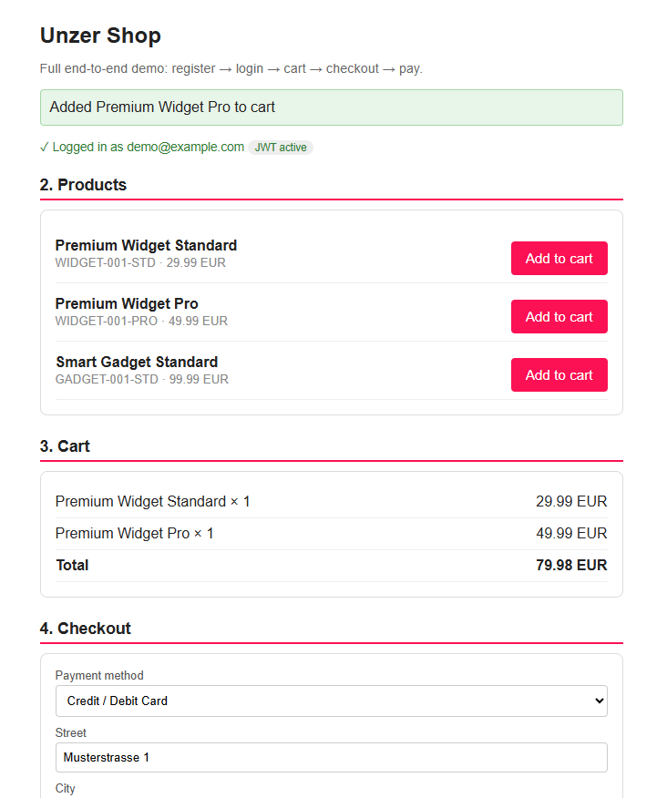
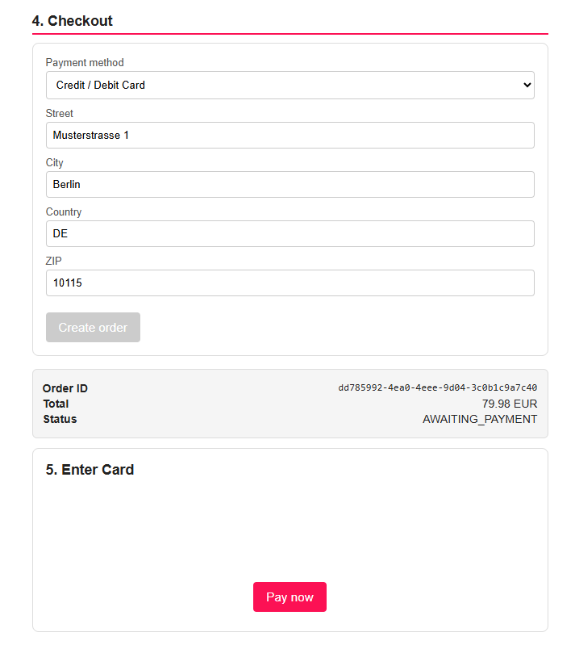
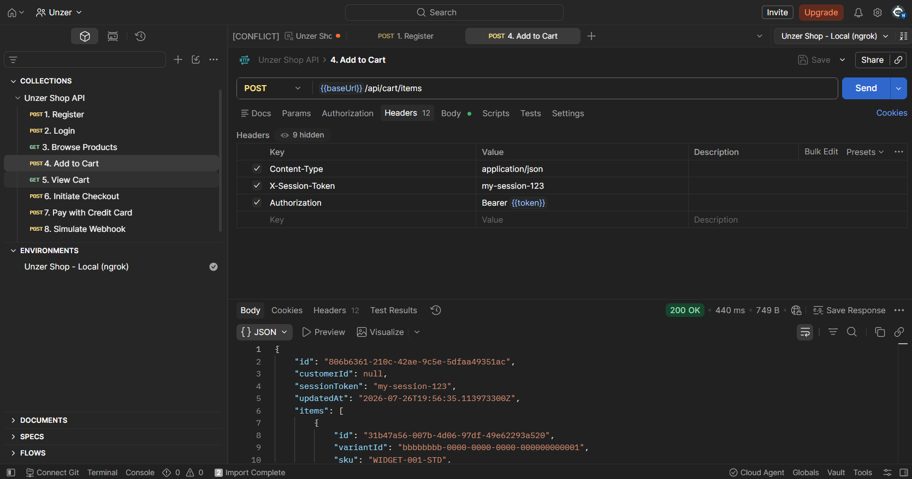
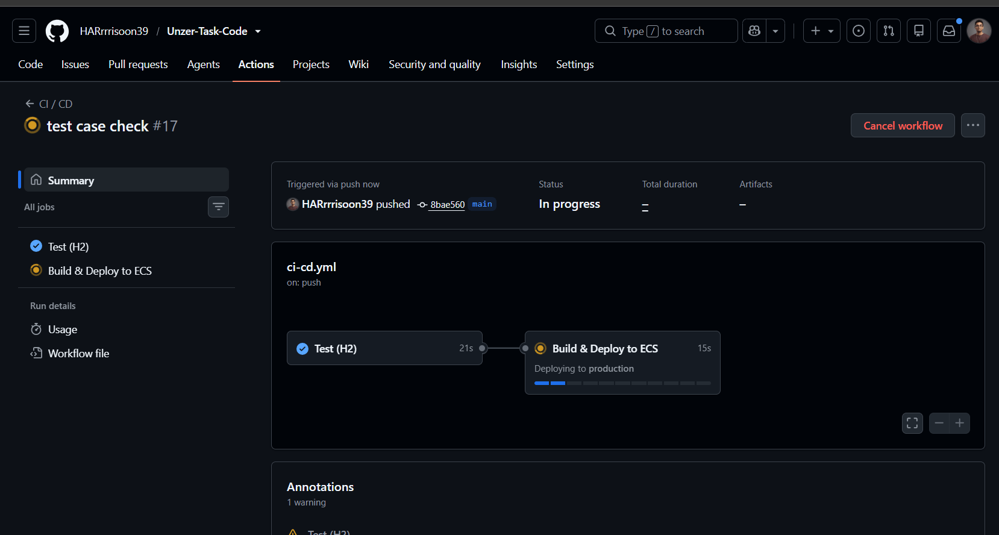

# Unzer E-Commerce Shop

Spring Boot backend for an online shop with Unzer payment integration (Credit Card, Wero, Open Banking).

- **Architecture:** [`architecture.md`](../architecture.md)
- **Vertical slice:** checkout → stock reservation → Unzer payment → webhook confirmation

---

## Run Locally

Requires Java 21 and Maven. Uses H2 in-memory DB.

```bash
cd shop
mvn spring-boot:run
```

- Cart page: `http://localhost:8080/checkout.html`
- H2 console: `http://localhost:8080/h2-console` (JDBC URL: `jdbc:h2:mem:shopdb`, user: `sa`, password: empty)

---

## Setup

**Step 1 — Start ngrok** (Terminal 1, leave it running)
```bash
ngrok http 8080
# → copy the https URL e.g. https://abc123.ngrok.io
```

**Step 2 — Add your keys** to `src/main/resources/application-local.yml` (gitignored, never committed)
```yaml
unzer:
  private-key: s-priv-xxx       # given at the interview
  public-key: s-pub-xxx         # given at the interview
  webhook-url: https://abc123.ngrok.io      # your ngrok URL
  return-url-base: https://abc123.ngrok.io  # your ngrok URL
```

**Step 3 — Start the app** (Terminal 2)
```powershell
cd shop
mvn spring-boot:run
```

The app auto-loads `application-local.yml` and registers the webhook with Unzer on startup. Open `http://localhost:8080/checkout.html` to demo.

---

## Demo Screenshots

### 1. Checkout Page


### 2. Payment Flow


### 3. Test API via Postman



Open the Postman collection to test all endpoints:
👉 [Unzer Shop API — Postman Collection](https://harirajan2611-3545966.postman.co/workspace/Unzer~3f17ffb5-d918-48a0-ac22-1835f8432cb5/collection/56911596-122224fb-4f08-4aca-b81b-e4a1f4ba764b?action=share&creator=56911596&active-environment=56911596-5148d445-ba3d-4eab-8980-94a8bb724076)

The collection includes 8 pre-built requests (Register → Login → Browse Products → Add to Cart → View Cart → Initiate Checkout → Pay with Credit Card → Simulate Webhook) with the `Unzer Shop - Local (ngrok)` environment pre-configured.

### 4. H2 In-Memory Database

Open `http://localhost:8080/h2-console` while the app is running. Connect with:

| Field | Value |
|---|---|
| JDBC URL | `jdbc:h2:mem:shopdb` |
| User Name | `sa` |
| Password | *(leave empty)* |

The console shows all tables created by Flyway migrations:


Tables present: `CART`, `CART_ITEM`, `CUSTOMER`, `INVENTORY`, `ORDER_LINE`, `ORDER_STATUS_HISTORY`, `PAYMENT`, `PAYMENT_EVENT`, `PRODUCT`, `PRODUCT_VARIANT`, `RESERVATION`, `SHOP_ORDER`, `flyway_schema_history`.

### 5. CI/CD Pipeline

Every push to `main` triggers the `ci-cd.yml` GitHub Actions workflow with two sequential jobs:

1. **Test (H2)** — runs `mvn test` against the in-memory H2 database (~21 s). Must pass before deployment starts.
2. **Build & Deploy to ECS** — builds the Docker image, pushes to ECR, and deploys to the `production` ECS service (~15 s).



---

## Sandbox Test Cards

| Card | Number | Expiry | CVC |
|---|---|---|---|
| Visa | `4444333322221111` | `03/99` | `123` |
| Mastercard | `5188340000000016` | `12/2025` | `123` |

Never use real card data. Sandbox keys (`s-priv-`) never reach real networks.
